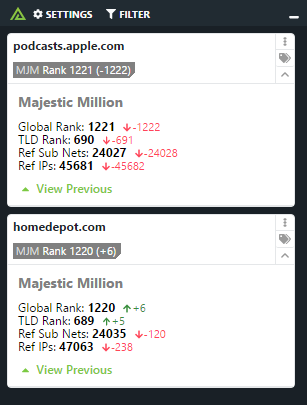

# Polarity Majestic Million

Returns information about domains in the Majestic Million, the million domains with the most referring subdomains.  For more information about the Majestic Million please see https://majestic.com/reports/majestic-million.

|  |
|---|
|*Majestic Million Example*|

The Majestic Million integration loads the Majestic Million CSV file.  The integration provides global rank information about domains within the list.

## Installation Instructions

Installation instructions for integrations are provided on the [PolarityIO GitHub Page](https://polarityio.github.io/).

## Polarity

Polarity is a memory-augmentation platform that improves and accelerates analyst decision making.  For more information about the Polarity platform please see:

https://polarity.io/
